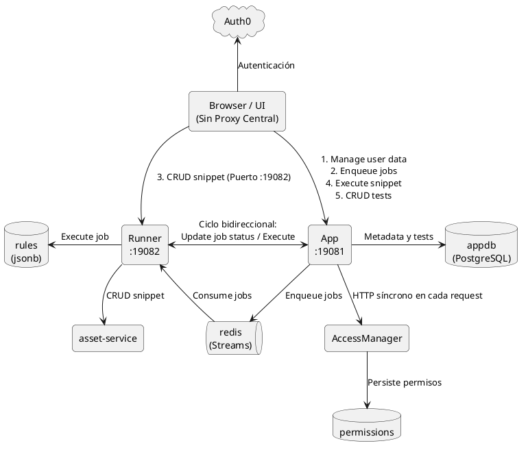
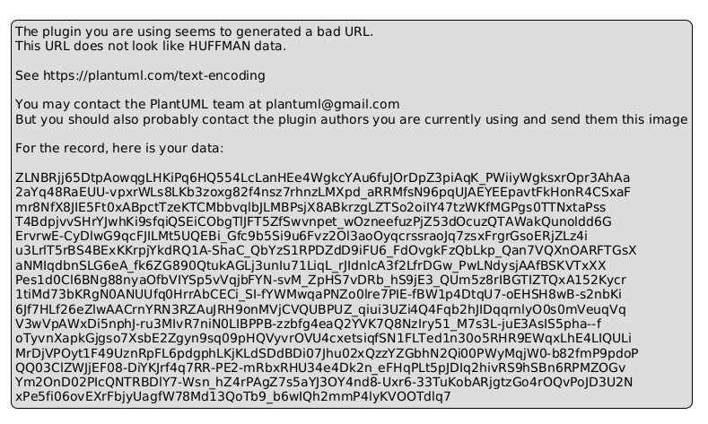
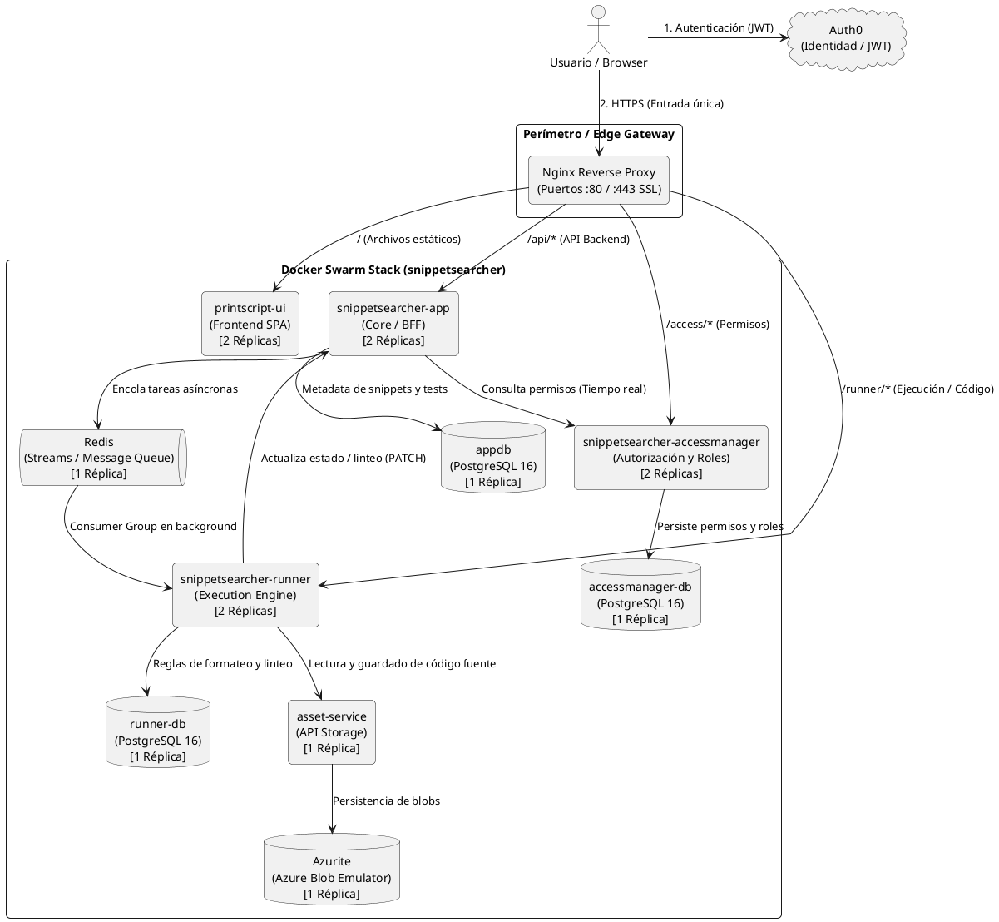
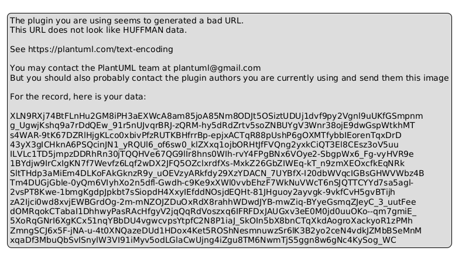
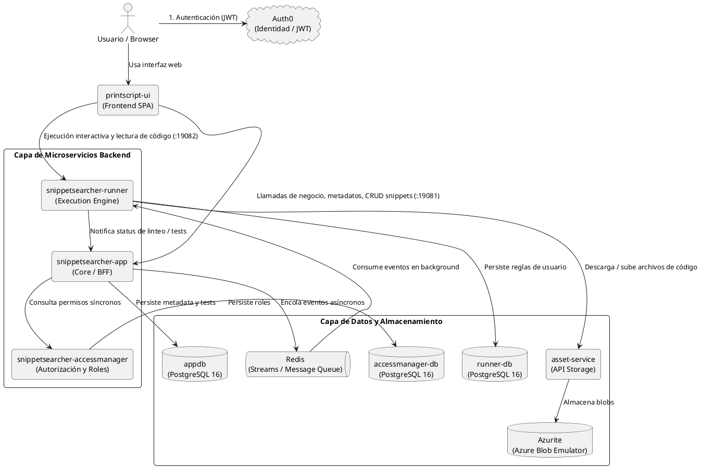

# INFORME DE ANÁLISIS ARQUITECTÓNICO: SNIPPETSEARCHER

---

## 1. Contexto y Restricciones Obligatorias
El proyecto cuenta con restricciones formales impuestas por el entorno y la cátedra:
* **Cantidad de Microservicios**: Mínimo obligatorio de 3 servicios backend independientes (`App`, `AccessManager`, `Runner`).
* **Base de Datos**: PostgreSQL como base relacional obligatoria.
* **Middleware**: Redis (utilizado **EXCLUSIVAMENTE como Cola de Mensajería / Streams**) y AssetService (Object / Blob Storage para código fuente).
* **Reverse Proxy / Gateway**: Nginx para enrutamiento, terminación SSL y aislamiento de red.
* **Infraestructura**: Despliegue en Máquinas Virtuales (VMs) Linux mediante **Docker Swarm** (Stacks declarativos con réplicas stateless y balanceo interno) en entornos de servidores (`dev` y `prod`), y Docker Compose para desarrollo local.
* **Autenticación**: Auth0 (JWT Bearer tokens y protección de rutas).
* **Monitoreo & Trazabilidad**: New Relic con `-javaagent:newrelic.jar` y correlación continua vía `X-Request-Id`.
* **Objetivo de Diseño**: Lograr máxima cohesión, bajo acoplamiento (principios SOLID), tipado estricto, justificación real de cada componente y extensibilidad multi-lenguaje (PrintScript, Go, Rust, Python).

---

## 2. Diagnóstico de la Arquitectura Actual (Vieja)

En la arquitectura previa, los componentes se comunicaban con acoplamiento cruzado y sin un gateway formal:

### Diagrama PlantUML (Arquitectura Vieja)


### Contras y Problemas Críticos de la Arquitectura Vieja
1. **Frontend como "Orquestador" (Falta de Nginx Reverse Proxy / BFF)**:
   * El cliente web debía conocer dos URLs y puertos distintos (`:19081` para `App` y `:19082` para `Runner`).
   * Para visualizar un snippet, la UI debía orquestar dos peticiones en paralelo (`apiService.getSnippetData` y `runnerService.getSnippetContent`).
2. **Dependencia Circular / Acoplamiento Bidireccional**:
   * `App` llamaba a `Runner` para ejecutar snippets y correr tests, pero al crear un snippet, `Runner` llamaba de regreso a `App` (`appClient.registerSnippet`). Esto generaba ciclos indeseables entre microservicios.
3. **El caso de testeo de snippets (Teléfono descompuesto de 4 saltos HTTP)**:
   * Al ejecutar un test, `App` consultaba el test en Postgres y se lo enviaba a `Runner` por HTTP; `Runner` tenía que hacer un salto HTTP a `AssetService` para bajarse el código del snippet; luego `Runner` ejecutaba, respondía a `App` y `App` respondía a la UI. Si se corrían 5 tests seguidos, el código se descargaba 5 veces por red.
4. **El antipatrón de `jsonb` ("bjson") y `text[]`**:
   * En `FormattingRule`, `LintingRule` y `Test`, la configuración se guardaba como `columnDefinition = "jsonb"` mapeada a `Map<String, Any>` y los inputs/outputs como `text[]`.
   * **Inconvenientes**: Pérdida total de *Type Safety* en Kotlin, dependencia de sintaxis específica de PostgreSQL (dificultando tests locales en memoria con H2/SQLite) y necesidad de convertidores ad-hoc (`MapJsonConverter`).
5. **`AccessManager` con "Chatty HTTP"**:
   * En cada operación de usuario, `App` hacía llamadas HTTP síncronas a `AccessManager` para evaluar autorizaciones, sumando latencia y creando un punto único de fallo (*Cascading Failures*).
6. **Trazabilidad fragmentada en New Relic**:
   * Como la UI llamaba por separado a `App` y `Runner`, cada llamada recibía un `X-Request-Id` distinto, partiendo las transacciones en árboles desconectados.

---

## 3. Arquitectura Nueva Optimizada

La arquitectura optimizada se detalla en dos vistas complementarias:
1. **Vista de Infraestructura y Producción (Con Nginx Reverse Proxy)**: Con Nginx como Edge Gateway perimetral, terminación SSL y distribución a las 2 réplicas por servicio en Docker Swarm.
2. **Vista Lógica de Microservicios (Sin Nginx)**: Conexiones directas de negocio entre UI, App, Runner, AccessManager, colas y almacenamiento.

---

### A. Vista de Producción y Despliegue (Con Nginx)



*Diagrama fuente:* [`diagramas/arquitectura_con_nginx.puml`](diagramas/arquitectura_con_nginx.puml)



---

### B. Vista Lógica de Componentes (Sin Nginx)



*Diagrama fuente:* [`diagramas/arquitectura_sin_nginx.puml`](diagramas/arquitectura_sin_nginx.puml)



### Las Mejoras Fundamentales

#### A. Nginx como Reverse Proxy / API Gateway
* **Seguridad & DMZ**: Oculta la topología interna. Solo los puertos 80 y 443 de Nginx están expuestos a internet; los microservicios corren en una red interna privada.
* **Ruteo de Rutas**: `/api/*` se reenvía a `App` (`:19081`), mientras que `/` sirve la aplicación web compilada.
* **Terminación SSL**: Maneja HTTPS y certificados TLS de forma centralizada.

#### B. Backend For Frontend (BFF) en `App`
* **Cambio**: La UI únicamente se comunica con `App` a través de Nginx.
* **Mecanismo**: `App` actúa como fachada única. Cuando la UI solicita o guarda un snippet, `App` delega internamente a `Runner` la lectura/escritura en `AssetService`.
* **Beneficio**: El frontend desconoce los puertos internos; se reduce la complejidad del cliente web.

#### C. Redis EXCLUSIVAMENTE como Cola de Mensajería (Streams Queue)
* **Principio de Responsabilidad Única**: Redis no almacena caché de permisos ni de código. Su único rol es ser el **Message Broker** para procesamiento asíncrono y tolerante a fallos (User Stories #12 y #15).
* **Consistencia Inmediata (Zero Stale Data)**: Al no cachear permisos, `AccessManager` es siempre la **única fuente de la verdad en tiempo real**. Si se revoca un permiso, tiene efecto instantáneo en el milisegundo cero.
* **Tolerancia a Fallos**: Implementación con Consumer Groups (`runner_group`), lectura bloqueante (`XREADGROUP`) y acuse de recibo (`XACK`). Si el Runner se reinicia, los mensajes pendientes (PEL) se reanudan automáticamente.

#### D. Engine Central con Plugins en Runner (Strategy Pattern)
* En el Runner se definió la abstracción extensible:
  ```kotlin
  interface LanguageRunner {
      val language: String
      val fileExtension: String
      fun execute(code: String, inputs: List<String>, env: Map<String, String>): ExecutionOutput
      fun format(code: String, rules: Map<String, Any>): String
      fun lint(code: String, rules: Map<String, Any>): LintOutput
  }
  ```
* El `LanguageRunnerRegistry` registra automáticamente los plugins anotados con `@Component` (`PrintScriptLanguageRunner`, `PythonLanguageRunner`, etc.), permitiendo extender a nuevos lenguajes sin tocar los controladores (Open/Closed Principle).

#### E. Rediseño de Base de Datos y Eliminación de `jsonb` y `text[]`
* Tablas relacionales normalizadas (`user_language_rules`, `test_cases`, `test_inputs`, `test_outputs`).
* Integridad referencial con `CONSTRAINT fk_test_snippet FOREIGN KEY (id_snippet) REFERENCES snippet(id) ON DELETE CASCADE`.

#### F. Trazabilidad Unificada con New Relic
* El header `X-Request-Id` se propaga en cascada a través de todos los clientes HTTP (`AppClient`, `RunnerClient`, `AccessManagerClient`) y se asocia al MDC de logs.
* En New Relic, cada petición genera un **Trace Map continuo y unificado** de extremo a extremo.

---

## 4. Cuadro Comparativo: Pros y Contras

| Aspecto | Arquitectura Vieja | Arquitectura Nueva (Actual) |
| :--- | :--- | :--- |
| **Proxy Exterior** | **Contras**: Sin proxy central. El navegador interactuaba directamente con puertos de microservicios (`:19081`, `:19082`). | **Pros (Nginx)**: Proxy inverso único en puertos 80/443. Aísla la red interna, maneja SSL y rutea tráfico. |
| **Punto de Contacto de la UI** | **Contras**: La UI debía coordinar llamadas a `App` y `Runner`. Alto acoplamiento con la infraestructura. | **Pros (BFF)**: La UI solo se comunica con `App`. Consistencia de contrato y desacople de puertos internos. |
| **Rol de Redis** | Sin uso claro o mezclado. | **Pros (Cola Pura)**: EXCLUSIVAMENTE cola de mensajería (Redis Streams) para linteo y formateo masivo tolerante a fallos. |
| **Políticas de Autorización** | Chatty HTTP con posible inconsistencia. | **Pros**: Consulta directa en tiempo real a `AccessManager`. Cero datos obsoletos (*zero stale permissions*). |
| **Soporte de Lenguajes** | PrintScript hardcodeado dentro del Runner. | **Pros**: Engine Central con Plugins (`LanguageRunner`). Soporta Python, Go o Rust mediante Strategy Pattern. |
| **Persistencia de Reglas** | Uso de `jsonb` en Postgres con `Map<String, Any>` sin tipado. | **Pros**: Tablas relacionales normalizadas con tipos estrictos e integridad referencial `ON DELETE CASCADE`. |
| **Trazabilidad New Relic** | Trazas partidas en árboles independientes. | **Pros**: Traza distribuida continua y unificada con correlación por `X-Request-Id` de punta a punta. |
| **Cantidad de Microservicios** | 3 servicios desbalanceados y riesgo de un 4to innecesario. | **3 servicios justificados y balanceados**: Negocio/BFF (`App`), Seguridad/Políticas (`AccessManager`) y Cómputo/Sandbox (`Runner`). |

---

## 5. Guía: Cómo Agregar un Nuevo Lenguaje (ej. Python o Go)

Gracias al patrón Strategy y al Engine Central, agregar un lenguaje solo requiere 3 pasos:

1. **Crear el Plugin en `SnippetSearcher-Runner`**:
   Crear una clase anotada con `@Component` que implemente [`LanguageRunner`](file:///C:/Users/laris/Downloads/Ingsis/SnippetSearcher-Runner/src/main/kotlin/com/grupo14IngSis/snippetSearcherRunner/engine/LanguageRunner.kt) (ej. `PythonLanguageRunner` ejecutando `ProcessBuilder("python3")`).
2. **Instalar el Compilador/Runtime en el `Dockerfile` de `Runner`**:
   Agregar `RUN apt-get update && apt-get install -y python3 python3-pip && pip install black flake8`.
3. **Cero cambios en el resto del sistema**:
   `App`, `AccessManager`, `AssetService` y `PostgreSQL` no requieren modificaciones. Solo se agrega el lenguaje en el selector de la UI.

---

## 6. Estándares de Ingeniería de Código y Convenciones Gradle
Para garantizar calidad homogénea y evitar duplicación entre los microservicios backend (`App`, `AccessManager`, `Runner`):
* **Convention Plugin (`myPlugin`)**: Implementado en `buildSrc/` en cada microservicio, centralizando la configuración de Kotlin, Ktlint, Detekt y JaCoCo. Al compilar emite `>>>>> myPlugin is working <<<<<`.
* **Formateo y Linteo**: Reglas unificadas vía [`.editorconfig`](file:///C:/Users/laris/Downloads/Ingsis/SnippetSearcher-Runner/.editorconfig) (Ktlint) y [`config/detekt/detekt.yml`](file:///C:/Users/laris/Downloads/Ingsis/SnippetSearcher-Runner/config/detekt/detekt.yml) (Detekt 1.23.8), heredadas directamente de PrintScript.
* **Pre-commit Hook**: Script [`.githooks/pre-commit`](file:///C:/Users/laris/Downloads/Ingsis/SnippetSearcher-Runner/.githooks/pre-commit) y tarea `installGitHook` que bloquea commits que incumplan formato, linteo, pruebas unitarias o cobertura.
* **Verificación en CI/CD**: Pasos remotos idénticos en `.github/workflows/ci-cd.yml` de cada microservicio previo a la construcción de contenedores Docker.
* Para el detalle exhaustivo, consultar [Calidad, Linter, Formateador y CI/CD](CALIDAD_LINTER_FORMATTER_CI.md).

---

## 7. Estrategia de Versionado y Tags en Docker Registry (GHCR)
Para balancear la automatización de despliegues y la trazabilidad inmutable:
* **Doble Tagging en CI/CD**: Cada imagen se publica con su tag de ambiente flotante (`:develop` o `:production`) para el despliegue automático en Swarm, y con un tag inmutable con el SHA del commit (`:<rama>-<commit>`).
* **Trazabilidad y Rollbacks**: Los tags con commit generan enlaces directos al commit en la interfaz de GitHub Packages y permiten rollbacks inmediatos a versiones exactas.
* Para el detalle exhaustivo, consultar [Estrategia de Tags Docker](ESTRATEGIA_TAGS_DOCKER.md).
