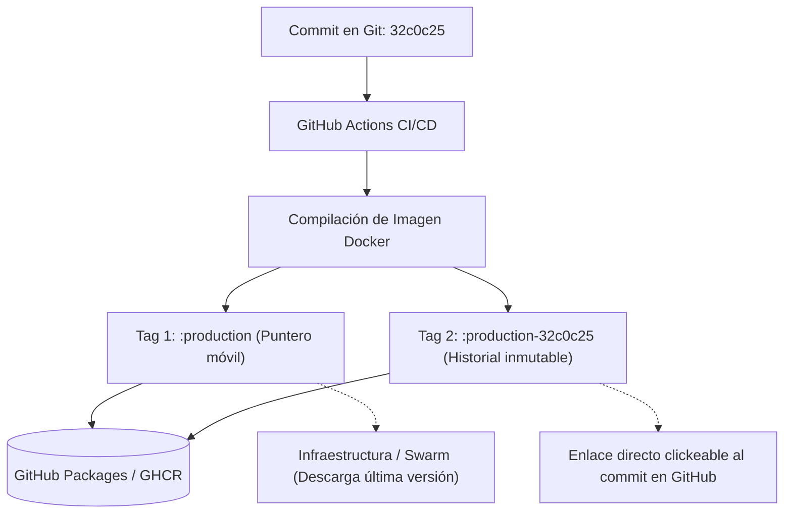

# Estrategia de Versionado y Etiquetado de Imágenes Docker (Tags)

Este documento detalla la arquitectura de etiquetado (tagging) de contenedores en **GitHub Container Registry (GHCR)** para los microservicios del ecosistema `SnippetSearcher` (`snippetsearcher-app`, `snippetsearcher-runner`, `snippetsearcher-accessmanager` y `printscript-ui`), analizando sus ventajas, desventajas, funcionamiento interno y cómo interactúa con el despliegue en producción y desarrollo.

---

## 1. La Problemática Inicial: El Tag Mutable (`:branch`)

En la configuración inicial, cada pipeline de CI/CD publicaba únicamente una etiqueta basada en la rama:
* `:develop`
* `:production`

### ¿Qué ocurría en GitHub Packages?
1. **Sobrescritura continua de la etiqueta**: Cada vez que se compilaba un commit en `production`, la etiqueta `:production` se desasociaba de la imagen anterior y apuntaba a la nueva.
2. **Imágenes huérfanas sin tag (Dangling / Untagged)**: Las versiones anteriores no se eliminan físicamente de GHCR, pero al perder la etiqueta, pasan a listarse únicamente por su hash binario (`sha256:cc41e8ef...`).
3. **Pérdida de trazabilidad**: Al ver una lista de 40 versiones llamadas `sha256:...`, no hay forma de saber qué código contenía cada una, ni a qué commit correspondía, impidiendo un rollback manual certero.
4. **Confusión entre Docker Digest y Git SHA**:
   * **Docker Layer Digest (`sha256:...`)**: Suma criptográfica calculada por el daemon de Docker a partir de las capas y tarballs binarios. No tiene relación con Git.
   * **Git Commit SHA (`32c0c25...`)**: Hash de Git calculado a partir del árbol de código, autor y mensaje de commit.

---

## 2. La Solución Adoptada: Doble Etiquetado (`:rama` + `:rama-commit`)

Para mantener lo mejor de ambos mundos sin romper la automatización existente, los workflows de CI/CD publican **dos etiquetas en simultáneo** para cada imagen compilada:

1. **Tag de Ambiente (Flotante / Mutable)**:
   * Ejemplo: `ghcr.io/grupo-14-ingsis/snippetsearcher-app:production`
   * *Propósito*: Sirve como puntero automático a la **última versión estable**. Permite que la infraestructura (`update_service.yml` / Docker Swarm) y scripts de despliegue descarguen siempre la última versión sin necesidad de modificar archivos YAML en cada deploy.
2. **Tag Inmutable de Trazabilidad (`<rama>-<commit>`)**:
   * Ejemplo: `ghcr.io/grupo-14-ingsis/snippetsearcher-app:production-32c0c25a8f...` (o `develop-<sha>`)
   * *Propósito*: Deja una instantánea permanente en el historial de GHCR.



---

## 3. Ventajas y Desventajas (Pros y Contras)

### Ventajas (Pros)
* **Trazabilidad 100% directa y visual**: En la interfaz web de GitHub Packages, al incluir el SHA del commit en el nombre del tag, GitHub lo reconoce y genera un **enlace directo clickeable al commit** en el repositorio. Permite auditar exactamente qué código está en cada imagen con un solo click.
* **Rollback trivial y seguro**: Si un deploy en producción falla o introduce un bug crítico, se puede revertir el servicio en el Swarm inmediatamente a una versión específica conocida:
  ```bash
  docker service update --image ghcr.io/grupo-14-ingsis/snippetsearcher-app:production-<commit_anterior> snippetsearcher_app
  ```
  Sin adivinar cuál de los `sha256:...` huérfanos era el correcto.
* **Compatibilidad retroactiva total**: El workflow de infraestructura (`update_service.yml`) y el despliegue continuo **no requieren cambios**, ya que siguen escuchando y descargando el tag `:production` o `:develop`.
* **Diferenciación clara de ambientes**: Al usar `<rama>-<commit>` en lugar de solo `<commit>`, se distingue de un vistazo si una imagen fue generada y testeada para el ambiente de `develop` o el de `production`.

### Desventajas (Contras) y Mitigaciones
* **Espacio acumulado en GHCR**: Al mantener identificadas múltiples versiones, el listado de imágenes crece a lo largo del tiempo.
  * *Mitigación*: GitHub Packages ofrece políticas de retención (*Package retention rules*) para eliminar automáticamente tags inmutables más viejos de X semanas/meses si se alcanza el límite de almacenamiento de la organización.
* **Tiempo adicional despreciable de push**: Se envía un tag adicional a GHCR en cada pipeline (toma < 1 segundo porque las capas binarias son idénticas y Docker solo envía el puntero de metadatos).

---

## 4. Comparativa con Otras Alternativas de Tagging

| Estrategia | Ejemplo | Pros | Contras | ¿Por qué no se eligió? |
| :--- | :--- | :--- | :--- | :--- |
| **Solo Rama (Original)** | `:production` | Sencillo, no llena el registro de nombres. | Cero trazabilidad; versiones viejas quedan huérfanas como `sha256:...` sin saber qué código tienen. | Falta de visibilidad y rollbacks imposibles. |
| **Nombre/Mensaje de Commit** | `:fix-login-bug` | Fácil de leer para un humano. | Caracteres no soportados por Docker (espacios, tildes, signos), riesgo de colisiones entre commits repetidos. | No es estándar ni seguro para Docker tags. |
| **Semantic Versioning (SemVer)** | `:v1.2.3` | Muy claro para lanzamientos formales. | Requiere generar tags de Git (`git tag v1.2.3`) manualmente o herramientas pesadas de release notes en cada push de desarrollo. | Demasiado restrictivo para entrega continua ágil en microservicios. |
| **Doble Tag Rama + Commit (Elegida)** | `:production` y `:production-<sha>` | Automatización intacta, historial inmutable, links clickeables directos al commit. | Crece el historial de tags visibles. | **Es el estándar de la industria en CI/CD moderna.** |

---

## 5. Implementación en los Workflows de CI/CD

### En servicios con comando Docker directo (`SnippetSearcher-App` y `printscript-ui`)
Se compila agregando múltiples flags `-t` y se pushean ambas etiquetas:
```yaml
- name: Build and push Docker image
  run: |
    branch=${GITHUB_REF_NAME}
    commit_sha=${GITHUB_SHA}
    docker build \
      -t ghcr.io/grupo-14-ingsis/snippetsearcher-app:$branch \
      -t ghcr.io/grupo-14-ingsis/snippetsearcher-app:$branch-$commit_sha .
    docker push ghcr.io/grupo-14-ingsis/snippetsearcher-app:$branch
    docker push ghcr.io/grupo-14-ingsis/snippetsearcher-app:$branch-$commit_sha
```

### En servicios con `docker/build-push-action` (`SnippetSearcher-Runner` y `SnippetSearcher-AccessManager`)
Se define una lista multilínea en el parámetro `tags`:
```yaml
- name: Build and push Docker image
  uses: docker/build-push-action@v5
  with:
    context: .
    file: ./Dockerfile
    push: true
    tags: |
      ghcr.io/grupo-14-ingsis/snippetsearcher-runner:${{ github.ref_name }}
      ghcr.io/grupo-14-ingsis/snippetsearcher-runner:${{ github.ref_name }}-${{ github.sha }}
```

---

## 6. ¿Qué pasa con el despliegue automático en la VM?
El pipeline de orquestación de infraestructura (`update_service.yml`) continúa descargando `:production` o `:develop` mediante:
```bash
docker pull ghcr.io/grupo-14-ingsis/${IMAGE_REPO}:${ENV_NAME}
IMAGE_DIGEST="$(docker image inspect "$IMAGE_URI" --format '{{index .RepoDigests 0}}')"
docker service update --with-registry-auth --image "$IMAGE_DIGEST" "$SWARM_SERVICE"
```
**No hay ninguna desincronización**: El Swarm sigue actualizándose con el último código disponible en la rama, pero ahora contás con un registro completo en GHCR para auditoría y rescate ante fallos.
